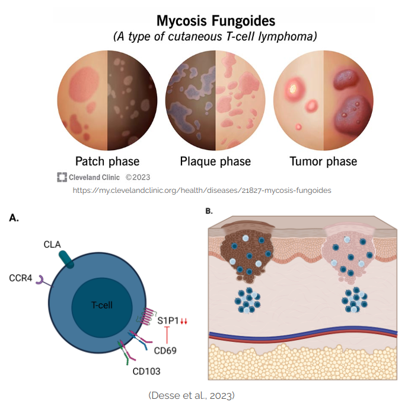

# Insights from Public Single-cell RNA Data to Identify Biomarkers in Mycosis Fungoides

Mycosis fungoides (MF) is the most common type of cutaneous T-cell lymphoma (CTCL), a diverse group of extranodal non-Hodgkin lymphomas. MF’s clinical variability, resemblance to benign skin conditions, and lack of specific biomarkers pose significant diagnostic and therapeutic challenges. Molecular biomarkers are urgently needed for early diagnosis, prognostication, and personalized treatment. While potential biomarkers for instance, dendritic cell defects, Myc, p53, and STATs have been studied, none are MF-specific, limiting their diagnostic or therapeutic utility. Single-cell RNA-sequencing (scRNA-seq) provides a powerful tool to analyze the skin's cellular architecture and tumor microenvironment, offering insights into MF-specific gene expression patterns. This technology can facilitate early MF detection, identify therapeutic targets, and improve treatment response monitoring. By leveraging publicly available data, this project seeks to uncover novel biomarkers that advance our understanding and management of MF.

This project has been started as the final project of Genomic course ECBM4060.

Contrinutors:
- Francesca Foglino,
- Sararose Suhl,
- Neema Nkontchou,
- Abdulaziz Alharmoodi,
- Arsalan Firoozi